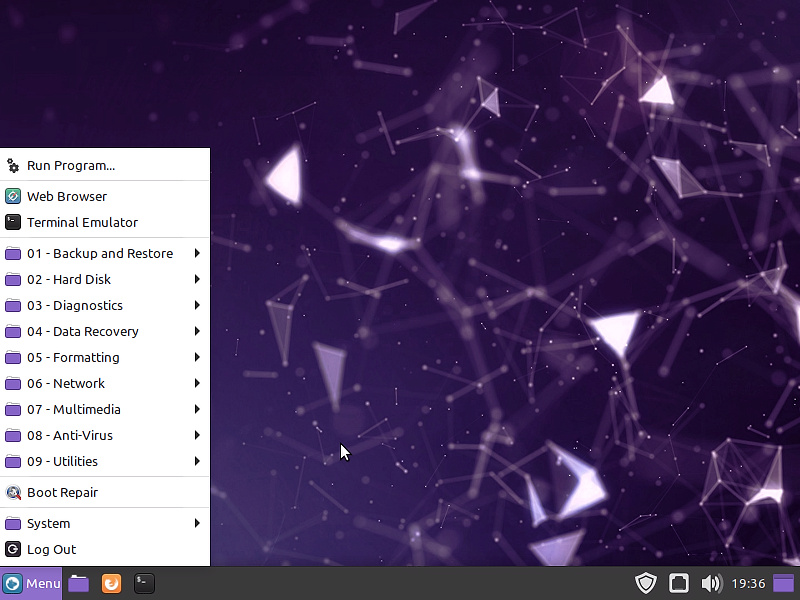

 

<h1 align="center">Live System Rescue</h1>

<h5 align="center"> Backup de arquivos, diagnóstico hardware, recuperação de arquivos, formatação de baixo nivel, remoção de virus e reparo do sistema. </h5>

 

  

 

