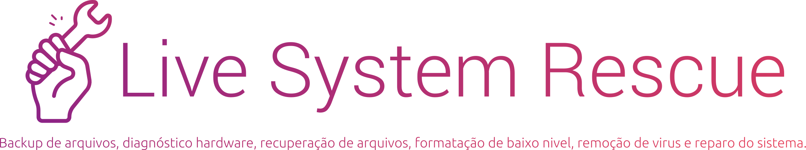
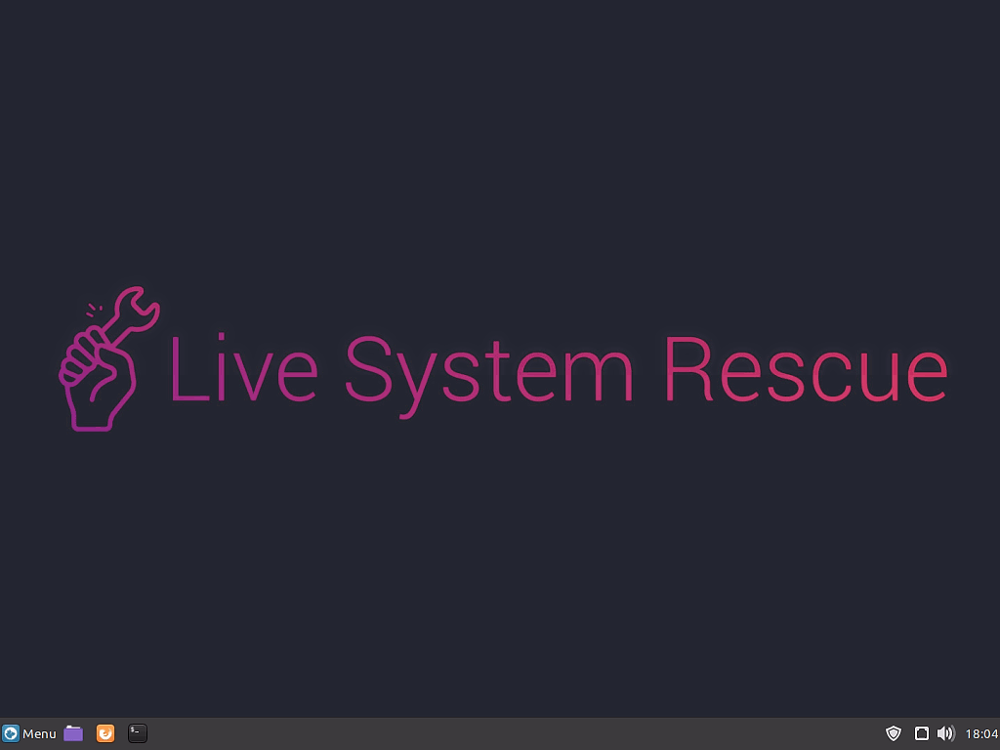

 

  

 

  

O Live System Rescue é uma modificação do Linux Mint 20.01 XFCE a ideia aqui é criar um liveCD para o dia a dia com ferramentas para backup de arquivos, diagnostico de hardware, recuperação de arquivos, formatação de baixo nivel, remoção de viŕus e reparo do sistema.

  

### Visite a Wiki para ver com detalhes todas as categorias, lista de programas e screenshots.

[01 - Backup and Restore](https://github.com/odiegoduarte/lsr/wiki/01-Backup-and-Restore)

[02 - Hard Disk](https://github.com/odiegoduarte/lsr/wiki/02-Hard-Disk)

[03 - Diagnostics](https://github.com/odiegoduarte/lsr/wiki/03-Diagnostics)

[04 - Data Recovery](https://github.com/odiegoduarte/lsr/wiki/04-Data-Recovery)

[05 - Formatting](https://github.com/odiegoduarte/lsr/wiki/05-Formatting)

[06 - Network](https://github.com/odiegoduarte/lsr/wiki/06-Network)

[07 - Multimedia](https://github.com/odiegoduarte/lsr/wiki/07-Multimedia)

[08 - Anti Virus](https://github.com/odiegoduarte/lsr/wiki/08-Anti-Virus)

[09 - Utilities](https://github.com/odiegoduarte/lsr/wiki/09-Utilities)

[10 - System Repair](https://github.com/odiegoduarte/lsr/wiki/10-System-Repair)

[FAQ](https://github.com/odiegoduarte/lsr/wiki/FAQ)

   